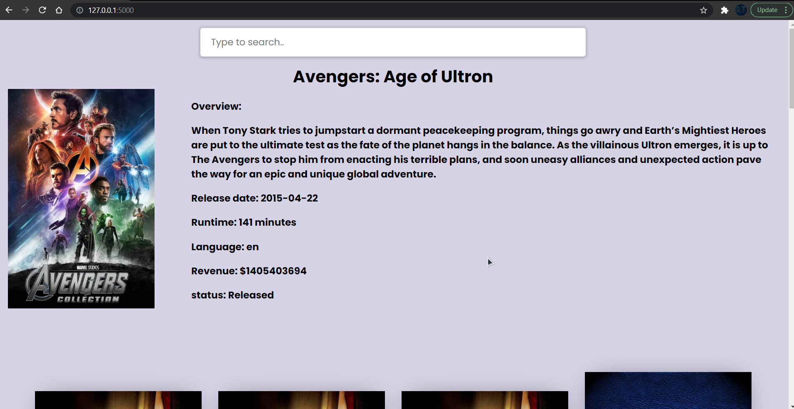

# Movie-recommendation-system
A movie recommendation system using machine learning model and AJAX.

Content Based Movie Recommender System recommends movies similar to the movie description.

#### [Python notebook](https://nbviewer.jupyter.org/github/atultyagi612/Movie-recommendation-system/blob/main/movie%20recommendation%20notebook.ipynb)

#### Machine learning model [download from here](https://drive.google.com/file/d/1PER3b0uOJG0Z0YFcpT9EPZ41l1ZZo-4d/view?usp=sharing)

#### Datasets [download from here](https://drive.google.com/file/d/1-CaWPZLtxoxKhmrMNAEaJMmC4X5_kED6/view?usp=sharing)

unable to upload Machine learning model and datasets here because github doesn't allow us to upload files more than 25gb

### Requirements
```
flask
pickle
werkzeug
gunicorn
sklearn
rapidfuzz
```

## Demo

#### 


#### 



<a href="https://drive.google.com/uc?export=view&id=<FILEID>">
